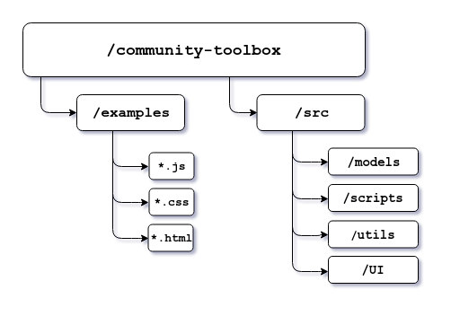
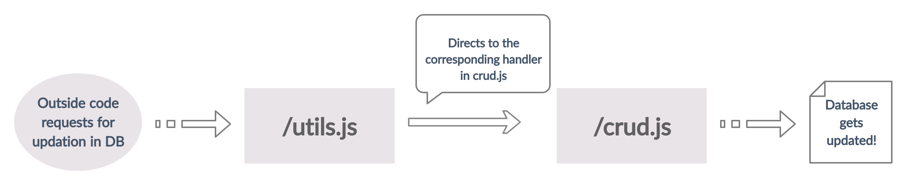
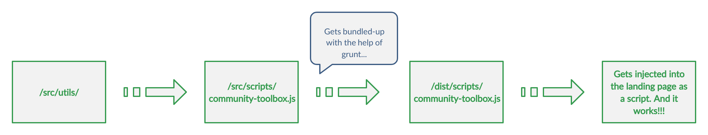
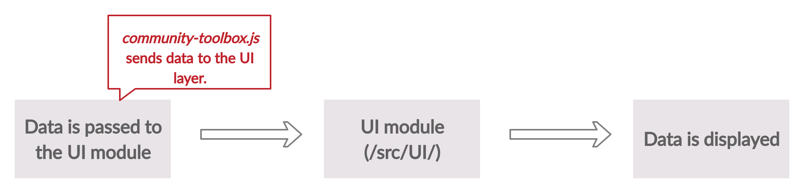

## Community Toolbox

A platform dedicated to community growth and getting insights on organization-wide activities.

## Table of Contents

1. [Project Overview](#project-overview)
2. [Getting Started](./docs/getting_started.md)
2. [How to Use](./docs/usage.md)

## Project Overview

The project structure of community toolbox is majorly divided into two groups,
- `/examples` contains code responsible for front-end styles and related scripts,
- `/src` contains the actual code for fetching data and showing it to the user.

As shown in the flowchart, `/src` inherits MVC like architecture. Here,

Fragment | Contains
--- | ---
`/models` | database related operations (Database layer)
`/scripts` | main source file (community-toolbox.js)
`/utils` | utility functions (Controller layer)
`/UI` | user interface functions (View layer)

---

### models

`models/` corresponds to the **Database Layer**. It is responsible for all the operations that happen on the database i.e., create, read and delete operations. The structure of `models/` ensures the segregation of code chunks based on their responsibilities.

There are 3 major categories to this:
- Setting up/initializing the database (initialize.js),
- Defining operations for the database (crud.js), and
- Providing a layer to communicate with the outside code (utils.js)

### scripts

`scripts/` contains the main entry point **_community-toolbox.js_** which is responsible for plugging every single functionality to the website. This file provides an interface to communicate with every feature that is present or is to be added later on. This file then gets bundled up with the help of grunt and that bundled-up version of the file is injected into the website as a script with the help of the landing page html file (index.html).

### utils

`utils/` acts as a **Controller Layer**, it contains code for various different features, majority of the code for any feature is present in this folder. This is to follow our approach of keeping main logic separate from the interface file (community-toolbox.js). This helps in making the code more readable and maintainable.

### UI

`UI/` acts as a **View Layer**, it is responsible for displaying data on the landing page. Data is given to UI functions and its their job to display that data on to the screen. These functions are broken up into different units according to the data they display.

- Data for repository contributors is displayed on the screen with the help of **_contributorsUI.js_**,
- Similarly, **_recentContributorsUI.js_** shows recent contributors' data on to the page, and likewise other functions show data accordingly.

### Up next

 - ### [Getting started guide](./docs/getting_started.md)
