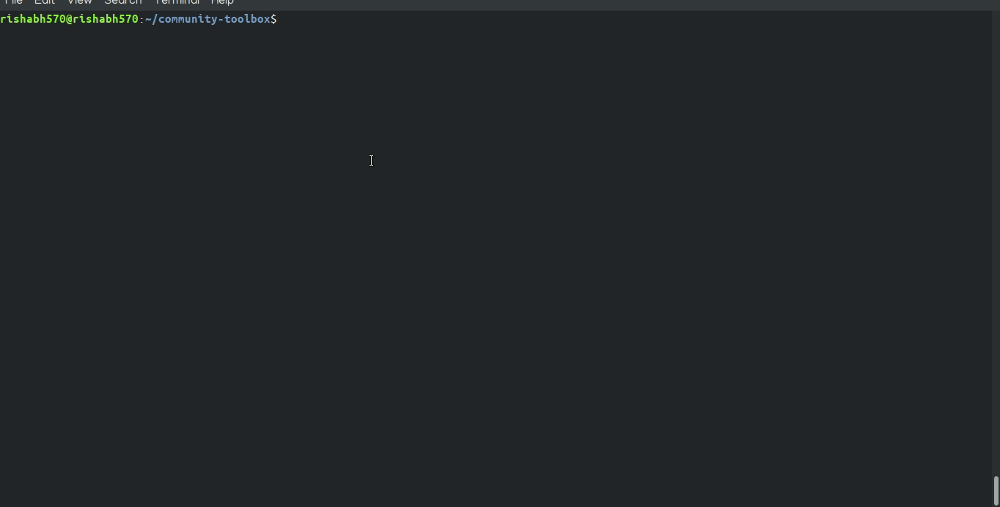

Getting Started
====

So you're almost there, just some info before you start building amazing things with us,

- To develop and build out Community Toolbox, you'll need to have `npm` installed. Run `npm install` to get all the dependencies installed.

- Community Toolbox is built using a Grunt task from the source files in `/src/`, and the compiled file is saved to `/dist/community-toolbox.js`. To build, run `grunt build`. To watch files for changes, and build whenever they occur, run `grunt`. 

- Most of the API calls are based on [github-api-simple](https://www.npmjs.com/package/github-api-simple) library.

## Developing :rocket: :tada:

### Installation instructions [ [Watch video guide](https://youtu.be/wkC2AgLiaTM) ]

* Fork our repo from. 

   ``` https://github.com/publiclab/community-toolbox ```
* Clone or download the repository into any fresh temporary folder.

   ```git clone https://github.com/your_username/community-toolbox.git ```

* Cd into that root folder you just cloned locally.

   ``` cd community-toolbox ```
   
* Add upstream.

   ``` git remote add upstream https://github.com/publiclab/community-toolbox.git```

* Open terminal in the current folder and to install all dependencies run

   ```npm install ```
   
   Update to new version of packages if required in package.json.
   
* Now go to the folder and run ```npm start``` .

* You are all set now, you can start making changes and see them taking place at `index.html` in the browser (you need to be doing `grunt build` for any changes you make in the `src/` folder).


### Testing

So after you've done changes, run 
```
npm test
```
to execute test suites.


## Contributing :computer:

We are happy to see you here and we welcome your contributions towards community-toolbox. Contributions are not limited to coding only, you can help in many other ways which includes leaving constructive feedback to people's Pull Request threads also.

Community-toolbox also provides an extensive list of issues, some of them includes labels like `first-timer-only`, `fto-candidate` and `help-wanted`. You can take a look at `first-timer-only` issues if you are new here but you are free to choose any issue you would like to work on.

If there's no issue available currently, you can take a look at the list of `stale issues` on [code.publiclab.org](https://code.publiclab.org) which contains issues that do not have their status updated for about 2 weeks.

After choosing an issue and doing changes in the code regarding that, you can open up a Pull Request (PR) to get your work reviewed and merged!

Here's a short GIF that helps in getting familiar with the process of opening a new Pull Request,




### Up next

 - ### [Usage](./usage.md)
